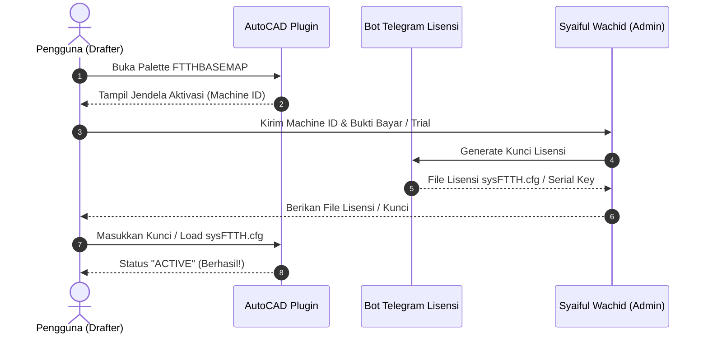

# Aktivasi Lisensi & Perpanjangan Langganan 🔑

FTTH Design Planner menggunakan sistem lisensi berbasis **Hardware Machine ID (HWID)** yang terkunci aman pada perangkat keras komputer Anda. Setiap lisensi menjamin penggunaan penuh seluruh fitur tanpa batasan jumlah gambar proyek.

---

## 📋 Alur Aktivasi Pertama Kali

### Langkah 1: Memperoleh Machine ID
1. Buka AutoCAD dan ketik `FTTHBASEMAP`.
2. Jika software belum teraktivasi, jendela **Aktivasi Lisensi** akan otomatis terbuka.
3. Anda akan melihat deretan kode unik **Machine ID** (contoh: `SWD-FTTH-8F4A2B...`).
4. Klik tombol **Copy Machine ID** untuk menyalin ke clipboard.

### Langkah 2: Konfirmasi Pembayaran & Request Lisensi
Kirimkan Machine ID tersebut beserta nama Anda ke kontak resmi:
- 💬 **WhatsApp**: [0822-3069-6953](https://wa.me/6282230696953)
- 💰 **Pembayaran**: Rp 100.000 / bulan (Tersedia QRIS Dinamis & Transfer Bank).

### Langkah 3: Memasang Kunci Lisensi
Setelah Anda menerima file lisensi `sysFTTH.cfg` atau kode serial aktivasi:
- **Opsi A (File .cfg)**: Simpan file `sysFTTH.cfg` ke folder plugin atau klik tombol **Browse License File** pada jendela aktivasi.
- **Opsi B (Serial Key)**: Tempelkan kode lisensi ke kotak teks, lalu klik **Aktivasi Sekarang**.
- Panel status akan berubah menjadi **Status: ACTIVE** dengan informasi masa berlaku aktif.

---

## ⏳ Perpanjangan Langganan
- Menjelang masa aktif habis (H-3), notifikasi pengingat ramah akan muncul di console AutoCAD.
- Untuk perpanjang, cukup lakukan pembayaran via QRIS dan konfirmasi via WhatsApp, lisensi Anda akan langsung diperpanjang tanpa perlu instal ulang software.
