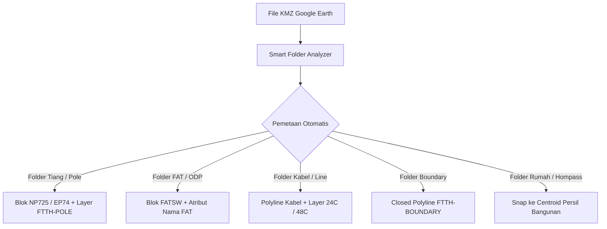

# Smart Import KMZ Engine & Mapper 📥

> 💡 **Nilai Bisnis & Efisiensi**: Mengubah file KMZ/KML mentah hasil survei Google Earth menjadi gambar kerja AutoCAD yang terstruktur dan siap pakai dalam hitungan detik. Mengotomatisasi pemetaan folder Google Earth ke blok tiang, FAT, dan layer CAD standar tanpa perlu plotting manual!

---

### 1. Cara Akses di AutoCAD
- **Command CAD**: `FTTH_SMART_IMPORT_KMZ`
- **Lokasi di Panel**: Buka Palette `FTTH Basemap` ➔ Tab **MAP & BASEMAP** ➔ Klik tombol **SMART IMPORT KMZ**.

---

### 2. Fitur Unggulan Smart Import Engine

1. **Auto Folder Mapping**: Mesin pintar mendeteksi penamaan folder di dalam KMZ (seperti `Poles`, `Tiang`, `FAT`, `ODP`, `Kabel`, `Boundary`, `Hompass`) dan otomatis mencocokkannya ke target layer dan blok AutoCAD.
2. **Interactive Mapping Window (`SmartImportWindow`)**: Anda dapat meninjau dan mengubah target layer, tipe entitas (Point / Polyline / Polygon), dan nama blok sebelum proses impor dieksekusi.
3. **Snap Road Alignment**: Garis jalan yang diimpor dapat diselaraskan secara otomatis dengan jaringan centerline.
4. **Snap Homepass to Parcel**: Titik hompass pelanggan otomatis di-snap ke dalam centroid persil bidang atap bangunan terdekat.
5. **Import Text & Annotations**: Label nama, elevasi, dan keterangan pada Google Earth Placemark otomatis diimpor sebagai MText dengan wipeout bersih.

---

### 3. Langkah Penggunaan (Step-by-Step)
1. Jalankan perintah `FTTH_SMART_IMPORT_KMZ`.
2. Pilih file `.kmz` atau `.kml` target dari komputer Anda.
3. Jendela **Smart KMZ Import & Layer Mapper** akan menampilkan rekapitulasi folder yang ditemukan beserta jumlah fiturnya.
4. Periksa kecocokan kolom **Target Layer** dan **Target Block/Entity**. Anda dapat mengubah dropdown pemetaan jika diperlukan.
5. Centang opsi lanjutan:
   - ☑️ *Snap Road Alignment*
   - ☑️ *Snap Homepass to Closest Parcel*
   - ☑️ *Import Placemark Labels as Text*
6. Klik tombol **Execute Smart Import**. Progres impor akan ditampilkan secara real-time via floating toast notification.
