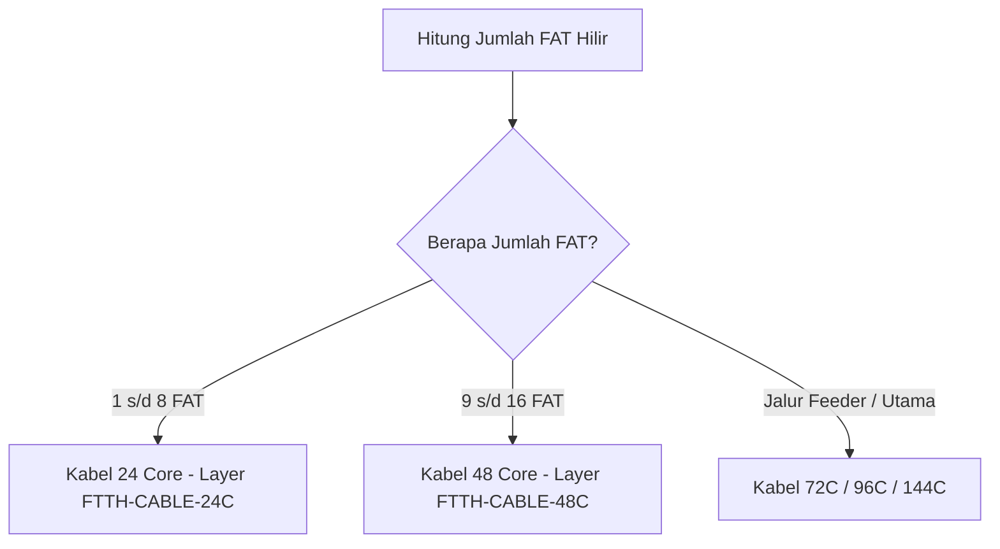

# Logika Penentuan Kapasitas Core Kabel (24C, 36C, 48C) 🧶

Plugin FTTH Design Planner secara otomatis menghitung beban akumulasi core yang melintasi setiap bentang kabel (*cable span*), lalu menetapkan kapasitas kabel dan layer yang tepat secara otomatis.

---

## 📐 Aturan Penentuan Kapasitas Kabel Distribusi

### 1. Perhitungan Jumlah Core per FAT
- Setiap FAT 16 Port membutuhkan **1 Core Layanan (Active Service Core)**.
- Setiap rute menambahkan alokasi **Core Cadangan (Spare / Expansion)** dan **Monitoring Core** sesuai profil konfigurasi ISP (misal rasio 1:2 atau buffer 20%).

### 2. Penataan Layer Otomatis
Kabel akan secara otomatis dimasukkan ke dalam layer spesifik dengan kode warna visual yang berbeda di AutoCAD:
- `FTTH-CABLE-24C`: Warna Hijau (Kapasitas kabel 24 Core).
- `FTTH-CABLE-48C`: Warna Biru (Kapasitas kabel 48 Core).
- `FTTH-CABLE-96C`: Warna Magenta (Kapasitas kabel feeder 96 Core).

---

## 🔄 Optimasi Penarikan Kabel
Jika dalam satu bentang tiang terdapat 2 jalur kabel yang menuju arah yang sama, sistem akan secara cerdas menyatukannya (*tapering*) ke kabel berkapasitas lebih besar (misal 2x 24C digabung menjadi 1x 48C) untuk menghemat biaya aksesoris gantung dan klem suspension tiang.
