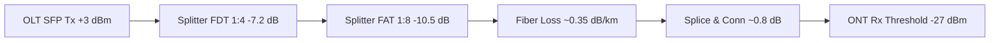

# Validasi Desain (DRC QA) & Kalkulator Budget Optik 🔬

> 💡 **Nilai Bisnis & Efisiensi**: Melakukan audit otomatis (*pre-flight check*) terhadap seluruh gambar kerja sebelum diajukan ke klien atau kontraktor pelaksana. Mencegah revisi berulang akibat bentang tiang melebihi batas, kelebihan kapasitas FAT, atau redaman optik yang melampaui batas link budget GPON.

---

## 🛡️ Bagian 1: Design Rule Check (DRC) QA Engine

### 1. Cara Akses di AutoCAD
- **Command CAD**:
  - `FTTH_DRC` (Jalankan pemindaian aturan desain menyeluruh)
  - `FTTH_DRC_CLEAR` (Bersihkan seluruh marker error dari layar)
- **Lokasi di Panel**: Klik tombol **`✅ DRC`** pada Quick Action Bar atau buka Tab **EXPORTS & REPORTS** ➔ Kartu **Design Rule Validation (QA)**.

### 2. Aturan yang Dipindai Otomatis
Sistem `DesignRuleValidator` memindai geometri spasial menggunakan struktur *SpatialGridIndex* berkecepatan tinggi:

| Aturan Desain | Ambang Batas Default | Tingkat Keparahan | Tindakan & Saran Sistem |
|---|:---:|:---:|---|
| **Max Pole Span** | $> 50.0\text{ meter}$ | `ERROR` 🔴 | Menandai bentang tiang terlalu panjang. Disarankan menambah tiang sisipan. |
| **Min Pole Span** | $< 5.0\text{ meter}$ | `WARNING` 🟡 | Menandai dua tiang yang terlalu berdekatan (indikasi duplikasi tiang). |
| **Over-Capacity FAT** | $> 8$ atau $> 16$ Hompass | `ERROR` 🔴 | Menandai FAT yang melayani hompass melebihi port splitter fisik. |
| **Max Drop Cable** | $> 150.0\text{ meter}$ | `WARNING` 🟡 | Jarak tarikan kabel drop dari FAT ke rumah pelanggan terlalu jauh. |
| **Centerline Gap** | $> 0.05\text{ meter}$ | `WARNING` 🟡 | Menandai as jalan yang terputus atau tidak menempel (*snap gap*). |

### 3. Marker Visual CAD di Layer `FTTH-QA-ERRORS`
Ketika ditemukan pelanggaran aturan, sistem **tidak hanya memunculkan teks**, melainkan langsung menggambar **simbol lingkaran silang interaktif** pada Model Space AutoCAD:
- Berada di layer khusus `FTTH-QA-ERRORS`.
- Menyimpan metadata penyebab error dan rekomendasi perbaikan (*Suggestion*) pada XData aplikasi `FTTH_QA_MARKER`.
- Anda dapat mengklik marker tersebut menggunakan perintah `FTTH_INSPECT` untuk melihat solusi perbaikannya secara instan.
- Setelah perbaikan selesai, ketik `FTTH_DRC_CLEAR` untuk menghapus seluruh marker visual.

---

## ⚡ Bagian 2: Optical Budget Calculator Engine

### 1. Cara Akses di AutoCAD
- **Command CAD**: `FTTH_CALC_BUDGET`
- **Lokasi di Panel**: Buka Palette `FTTH Basemap` ➔ Tab **ROUTING & DESIGN** ➔ Tombol **Calculate Link Budget**.

### 2. Preset Standar Industri GPON
Software telah menyediakan profil perhitungan preset yang sesuai dengan spesifikasi ITU-T G.984:

- **GPON Class B+**: Daya Pancar OLT $+3.0\text{ dBm}$, Sensitivitas Penerima ONT $-27.0\text{ dBm}$ (Total Dynamic Range: $30\text{ dB}$).
- **GPON Class C+**: Daya Pancar OLT $+5.0\text{ dBm}$, Sensitivitas Penerima ONT $-30.0\text{ dBm}$ (Total Dynamic Range: $35\text{ dB}$).

### 3. Formula Perhitungan Redaman Total:

$$\text{Total Loss (dB)} = (L_{\text{kabel}} \times \alpha) + (N_{\text{splice}} \times \text{Loss}_{\text{splice}}) + (N_{\text{conn}} \times \text{Loss}_{\text{conn}}) + \text{Loss}_{\text{FDT}} + \text{Loss}_{\text{FAT}} + \text{Safety Margin}$$

**Parameter Acuan**:
- **Redaman Serat Optik ($\alpha$)**: $0.35\text{ dB/km}$ pada panjang gelombang $1310\text{ nm}$ ($0.22\text{ dB/km}$ pada $1550\text{ nm}$).
- **Rugi Splitter FDT (1:4)**: $7.2\text{ dB}$.
- **Rugi Splitter FAT (1:8)**: $10.5\text{ dB}$ ($13.8\text{ dB}$ untuk rasio 1:16).
- **Rugi Fusion Splice**: $0.05\text{ dB}$ per titik sambung.
- **Rugi Konektor SC/APC**: $0.25\text{ dB}$ per pasang.
- **Safety Margin Cadangan Penuaan**: $2.0\text{ dB}$.

### 4. Status Kelulusan (PASS / FAIL)
Sistem otomatis mengevaluasi daya terima di titik terjauh:
- **STATUS: PASS (Optimal)**: Sinyal tiba di ONT berada di antara $-15\text{ dBm}$ hingga $-24\text{ dBm}$ (Margin aman $\ge 3\text{ dB}$).
- **STATUS: FAIL (High Loss)**: Redaman melebihi batas sensitivitas ONT. Sistem memberikan rekomendasi pemotongan rute atau penyesuaian rasio splitter.
