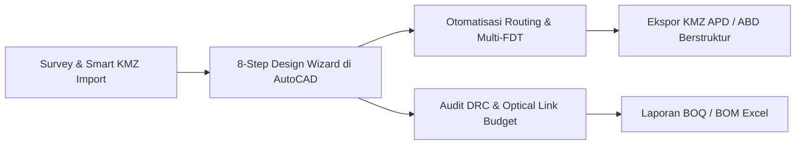

# Selamat Datang di FTTH Design Planner Help Center 🚀

**FTTH Design Planner v3.6.9 (r22)** adalah plugin profesional terintegrasi untuk Autodesk AutoCAD yang dirancang khusus untuk memotong waktu perencanaan jaringan fiber optik (FTTH - *Fiber To The Home*) hingga **80% lebih cepat**. 

Mulai dari impor batas wilayah KML/KMZ pintar (Smart Import), mode panduan alur kerja (*Design Wizard 8-Langkah*), unduh peta satelit otomatis, penataan nomor hompass ribuan rumah, penempatan tiang dan FAT cerdas, penarikan rute kabel otomatis (Auto Routing Dijkstra), audit kualitas desain otomatis (*Design Rule Check QA Markers*), kalkulasi redaman optik (*Optical Budget Calculator*), hingga ekspor KMZ berstruktur dan Bill of Materials (BOM/BOQ) ke Excel.

---

## 🌟 Fitur Utama & Keunggulan Baru (v3.6.9 r22)

- 🧙 **8-Step Design Wizard**: Alur kerja terpandu langkah-demi-langkah yang memudahkan desainer menyelesaikan proyek tanpa ada tahap yang terlewat.
- 📥 **Smart KMZ Import Engine**: Memetakan struktur folder Google Earth ke layer dan blok tiang/FAT AutoCAD secara otomatis dengan penyesuaian *Road Snap* dan *Homepass-to-Parcel*.
- ✅ **Design Rule Check (DRC) QA**: Audit desain otomatis berstandar telekomunikasi yang langsung menandai kesalahan bentang tiang, kelebihan kapasitas FAT, atau redaman berlebih dengan **marker visual di layer `FTTH-QA-ERRORS`**.
- 🔬 **Optical Budget Calculator**: Simulasi redaman GPON Class B+ dan Class C+ (1310/1490/1550 nm) dengan memperhitungkan rugi-rugi splitter FDT/FAT, splice, konektor, dan *safety margin*.
- ⚡ **Pencarian Cepat & Quick Actions**: Cari fitur apa saja dengan tombol `Ctrl+F` atau jalankan operasi cepat melalui baris aksi 1-klik (`📍 Place`, `⚡ Ortho`, `🏷️ Label`, `🛣️ Road`, `✅ DRC`, `📊 Status`).
- 🤖 **SWD AI Assistant (Beta)**: Tombol asisten cerdas terintegrasi untuk membantu analisis gambar dan drafting FTTH.

---

## 🧭 Panduan Navigasi Cepat

Pilih topik di bawah ini untuk memulai:

-   :material-rocket-launch: **[Panduan Memulai (Quick Start)](01-getting-started/system-requirements.md)**
    
    ---
    Persyaratan sistem, instalasi installer r22, aktivasi lisensi mesin, pengenalan UI Slate-Indigo, dan [Mode Panduan 8-Langkah (Design Wizard)](01-getting-started/design-wizard.md).

-   :material-map: **[Basemap & Area Isolasi](02-basemap-and-isolation/import-boundary.md)**
    
    ---
    Import file KML/KMZ biasa, [Smart KMZ Import & Layer Mapper](02-basemap-and-isolation/smart-import-kmz.md), download peta satelit HD & Bing GEOMAP, dan basemap jalan otomatis.

-   :material-home-city: **[Pendataan Hompass & Fasilitas](03-survey-and-hompass/generate-hompass.md)**
    
    ---
    Auto penomoran rumah (HPNUM) massal berurutan, remark hambatan lapangan, dan persil bidang tanah.

-   :material-map-marker-radius: **[Penempatan Aset & Tiang](04-asset-placement/pole-standards-and-placement.md)**
    
    ---
    Standar blok tiang (NP & Existing), tagging nomor tiang, clustering 16 rumah, penempatan FAT, dan [Selection Inspector](04-asset-placement/selection-inspector.md).

-   :material-cable-data: **[Routing Kabel Cerdas](05-cabling-and-routing/smart-routing-dijkstra.md)**
    
    ---
    Algoritma Dijkstra pencari rute terpendek, [FDT Line Manager & Multi-FDT](05-cabling-and-routing/fdt-line-manager.md), kapasitas core (24C-48C), dan putar balik kabel (tektok).

-   :material-file-export: **[Ekspor Data & Deliverables](06-export-and-deliverables/export-google-earth-kmz.md)**
    
    ---
    Generate KMZ APD & ABD berhirarki rapi, file Excel BOQ/BOM lengkap dengan aksesoris, dan [Audit DRC & Budget Optik](06-export-and-deliverables/design-validation-and-budget.md).

-   :material-lifebuoy: **[Solusi Masalah (Troubleshooting)](07-troubleshooting/license-issues.md)**
    
    ---
    Panduan mengatasi kendala lisensi, palette tidak terbuka, atau peta satelit blank.

-   :material-cash-check: **[Paket Harga & Komunitas](08-pricing-and-support/pricing-and-plans.md)**
    
    ---
    Informasi paket langganan Rp 100.000/bulan, cara pembayaran QRIS, dan link grup WhatsApp resmi.

---

## 📞 Butuh Bantuan Cepat?

Jika Anda membutuhkan bantuan teknis langsung atau ingin berkonsultasi mengenai implementasi proyek:
- 💬 **WhatsApp Admin**: [0822-3069-6953](https://wa.me/6282230696953)
- 👥 **Komunitas WhatsApp**: [Gabung Grup FTTH Design Planner](https://chat.whatsapp.com/DFjsdcWkD6b8WkG9XRYCsr)
- 🎬 **YouTube Playlist Tutorial**: [Tonton 18 Video Lengkap di YouTube](https://www.youtube.com/playlist?list=PLLr975-jxOLU)
