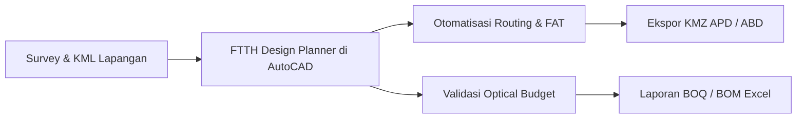

# Selamat Datang di FTTH Design Planner Help Center 🚀

**FTTH Design Planner v3.6.9** adalah plugin profesional terintegrasi untuk Autodesk AutoCAD yang dirancang khusus untuk memotong waktu perencanaan jaringan fiber optik (FTTH - *Fiber To The Home*) hingga **80% lebih cepat**. 

Mulai dari impor batas wilayah KML/KMZ, unduh peta satelit otomatis, penataan nomor hompass ribuan rumah, penempatan tiang dan FAT cerdas, penarikan rute kabel otomatis (Auto Routing Dijkstra), hingga ekspor KMZ berstruktur dan Bill of Materials (BOM/BOQ) ke Excel.

---

## 🌟 Mengapa Memilih FTTH Design Planner?

- ⚡ **Otomatisasi Tanpa Batas**: Ucapkan selamat tinggal pada penomoran tiang dan penarikan rute kabel satu-per-satu secara manual.
- 🎯 **100% Akurat & Georeferenced**: Terhubung dengan sistem koordinat dunia nyata (WCS UTM), sehingga hasil ekspor Google Earth dan GIS tidak pernah bergeser.
- 💼 **Standar Industri Telekomunikasi**: Format penamaan, skematik core FDT/FAT, dan pembagian cluster disesuaikan dengan standar ISP besar di Indonesia (Fiberhome, Telkom, Linknet, Moratel, MyRepublic, dll).
- 🤝 **Komunitas Aktif**: Didukung grup diskusi ratusan drafter FTTH se-Indonesia dan konsultasi langsung dengan pengembang (Syaiful Wachid).

---

## 🧭 Panduan Navigasi Cepat

Pilih topik di bawah ini untuk memulai:

-   :material-rocket-launch: **[Panduan Memulai (Quick Start)](01-getting-started/system-requirements.md)**
    
    ---
    Persyaratan sistem, cara instalasi via Inno Setup bundle, aktivasi lisensi mesin, dan pengenalan antarmuka.

-   :material-map: **[Basemap & Area Isolasi](02-basemap-and-isolation/import-boundary.md)**
    
    ---
    Import file KML/KMZ Google Earth, download peta satelit resolusi tinggi, dan gambar aspal jalan otomatis.

-   :material-home-city: **[Pendataan Hompass & Fasilitas](03-survey-and-hompass/generate-hompass.md)**
    
    ---
    Auto penomoran rumah (HPNUM) massal berurutan, remark hambatan lapangan, dan persil bidang.

-   :material-map-marker-radius: **[Penempatan Aset & Tiang](04-asset-placement/pole-standards-and-placement.md)**
    
    ---
    Standar blok tiang (NP & Existing), tagging nomor tiang, clustering 16 rumah, dan penempatan FAT cerdas.

-   :material-cable-data: **[Routing Kabel Cerdas](05-cabling-and-routing/smart-routing-dijkstra.md)**
    
    ---
    Algoritma Dijkstra pencari rute terpendek, pemilihan kapasitas core (24C-48C), dan aturan putar balik kabel (tektok).

-   :material-file-export: **[Ekspor Data & Deliverables](06-export-and-deliverables/export-google-earth-kmz.md)**
    
    ---
    Generate KMZ APD & ABD berhirarki rapi, file Excel BOQ/BOM lengkap dengan aksesoris, dan format HPDB/GeoJSON.

-   :material-lifebuoy: **[Solusi Masalah (Troubleshooting)](07-troubleshooting/license-issues.md)**
    
    ---
    Panduan mengatasi kendala lisensi, palette tidak terbuka, atau peta satelit blank.

-   :material-cash-check: **[Paket Harga & Komunitas](08-pricing-and-support/pricing-and-plans.md)**
    
    ---
    Informasi paket langganan Rp 100.000/bulan, cara pembayaran QRIS, dan link grup WhatsApp resmi.

---

## 📞 Butuh Bantuan Cepat?

Jika Anda membutuhkan bantuan teknis langsung atau ingin berkonsultasi mengenai implementasi proyek:
- 💬 **WhatsApp Admin**: [0822-3069-6953](https://wa.me/6282230696953)
- 👥 **Komunitas WhatsApp**: [Gabung Grup FTTH Design Planner](https://chat.whatsapp.com/DFjsdcWkD6b8WkG9XRYCsr)
- 🎬 **YouTube Playlist Tutorial**: [Tonton 18 Video Lengkap di YouTube](https://www.youtube.com/playlist?list=PLLr975-jxOLU)
